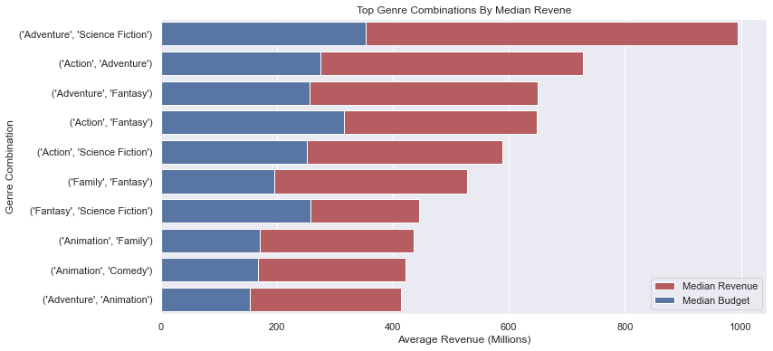
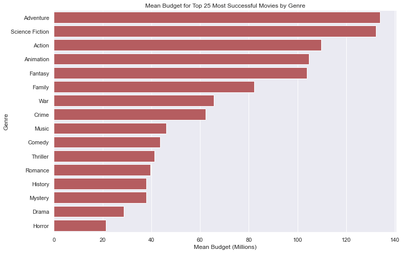
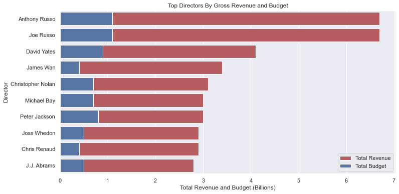
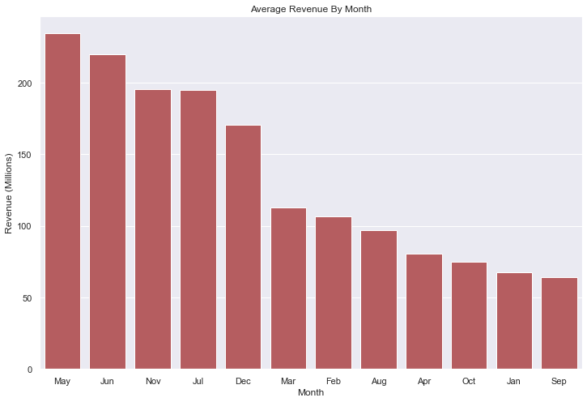

<<<<<<< HEAD
# Movies EDA 
**Author**: [Nick Timpano](mailto:nick.timpano@gmail.com)

## Overview
The purpose of this project was to analyze data on movies which could provide insights a new movie studio could use. Exploratory data analysis on open source information from several sources led to several conclusions on the following questions:
1. What genre(s) should be recommended? 
2. What budget should be used? 
3. Who are the actors,actresses and directors to recruit? 
4. When should the movie be released? 

#### Business Problem 
Microsoft sees all the big companies creating original video content and they want to get in on the fun. They have decided to create a new movie studio, but they don’t know anything about creating movies. You are charged with exploring what types of films are currently doing the best at the box office. You must then translate those findings into actionable insights that the head of Microsoft's new movie studio can use to help decide what type of films to create.

## Data 
Several sources of data were explored. [TMDB](https://www.themoviedb.org/?language=en-US) was mainly used for movie related data and [IMDB](https://www.imdb.com/interfaces/) was used for information on actors, actresses and directors. Some data was retrieved using the [TMDB API](https://developers.themoviedb.org/3/getting-started/introduction). 

Monetary information was adjusted for inflation using the [US Inflation Calculator](https://www.usinflationcalculator.com/inflation/historical-inflation-rates). 

## Results
- Adventure/Science fiction movies yield the highest average revenue 

- The average revenue for the top 25 most successful sci-fi and adventure movies is around 135MM USD  

- Movies that The Russo Brothers direct have the highest revenue and are among the most expensive to produce 

- Movies released in May have the highest average revenue 


## Conclusions 

- Make an adventure/sci fi movie if budget is not limited, and spend ~135MM 
- Recruit Robert Downey Jr. and The Russo Brothers maximize revenue, but consider other actors/actresses and directors with less popularity but strong reviews  
- Release the movie in May 

## Next Steps 
- Because this analysis mainly looked at higher budget movies and more popular movie industry professionals, further exploration into less mainstream work could yield interesting results. 
- Taking a deeper look at lower grossing, but otherwise popular genres, such as dramas could also provide more insights into the movie industry. 
- Comparing streaming movies to in theater movies. 
- Building a model to predict revenue or other measures of success. 

## More Information 
To see the full EDA please see the Jupyter Notebook. 

For more information, contact [Nick Timpano](mailto:nick.timpano@gmail.com)

## Repo Structure 

```
├── zippedData
├── avg_inflation_rates.csv
├── README.md
├── Movies EDA Presentation.pdf
├── Inflation Rate.ipynb
├── student_combined.ipynb
├── tmdb_scrape.py
└── tmdb_scrape_by_year.py
```

=======
This is a list of what's included in the project:   
  
Jupyer Notebook Files  
student_combined.ipynb - main file  
Inflation Rate.ipynb - used to retrieve inflation rate info   
  
Python Files - used for data scraping the TMDB API   
tmdb_scrape.py   
tmdb_scrape_by_year.py   

Movies EDA Presentation.pdf   

>>>>>>> e73406f7d24995182ef9e07aff30f6833a3bcfa6
